# Changelog Houston Education
### Ferraris a 200 por hora.

Todas as alterações notáveis deste projeto serão documentadas neste arquivo.

O formato é baseado em [Keep a Changelog](https://keepachangelog.com/pt-BR/1.0.0/),
e este projeto adere ao [Semantic Versioning](https://semver.org/lang/pt-BR/).


## Legenda

| Tag | Descrição |
|-----|-----------|
| `Added` | Novas funcionalidades adicionadas ao sistema |
| `Changed` | Alterações em funcionalidades existentes |
| `Deprecated` | Funcionalidades que serão removidas em versões futuras |
| `Removed` | Funcionalidades removidas nesta versão |
| `Fixed` | Correções de bugs e erros |
| `Security` | Correções e melhorias relacionadas à segurança |

---

## Como Versionar

Este projeto utiliza o padrão **SemVer** (Semantic Versioning):

- **MAJOR** (`X.0.0`): alterações incompatíveis com versões anteriores
- **MINOR** (`0.X.0`): adição de funcionalidades mantendo compatibilidade
- **PATCH** (`0.0.X`): correções de bugs e ajustes menores

Exemplo de evolução de versão:

```
0.1.0 -> 0.2.0 -> 0.3.0 -> 1.0.0 -> 1.1.0 -> 1.1.1
```

---

## Notes

- **Versões mais antigas ficam sempre abaixo das versões mais recentes, seguindo o padrão estabelecido.**

---

## [1.4.0] - 2026-05-25

### Added

**Expiração Automática de Monitorias**
- Adicionados campos `deletedAt` e `expiredAt` na tabela de monitorias.
- Criada função para marcar monitorias como expiradas após sua realização.
- Implementado cron job que verifica e expira monitorias automaticamente a cada 10 minutos.

**Alteração de Senha**
- Adicionada funcionalidade de mudança de senha com endpoint separado.

**Segurança da Senha do Admin**
- Implementado `pepper` no hash da senha do administrador para camada extra de segurança.
- Criada pasta `security` com utilitário para leitura da variável de ambiente.
- Adicionado arquivo `.env.example` com as variáveis necessárias do projeto.

### Changed

**Responsividade**
- Ajustes de CSS e melhorias de responsividade em diversas telas.

**Máscara de Matrícula**
- Adicionada máscara no campo de input de matrícula nas telas de cadastro e perfil.
- Reforçada validação no schema Yup durante o update de aluno, garantindo integridade dos dados.

### Fixed

**Login do Administrador**
- Corrigido erro que impedia o login com perfil admin.

**Endpoint de Histórico**
- Corrigida referência hardcoded para `localhost` no fetch do histórico de monitorias, ajustando para o ambiente correto.

**Correção na função de update de monitoria**
- Ajuste em bug que não permitia a atualização de uma monitoria por apitar um erro na função de conflito() que verifica se uma monitoria já existe em um horário e local específico. O erro era que o id da monitoria que estava sendo atualizada não era passado na função, fazendo com que a consulta não excluisse a mesma e estourava um conflito com a própria monitoria. 

### Security

- Adicionado `pepper` criptográfico ao hash de senha do administrador, aumentando a resistência contra vazamentos de banco de dados.

---

## [1.3.1] - 2026-05-24

### Added


**Nova logo**
- Nova logo personalizada que reflete a Houston Education.

### Changed

**Layout de Gerenciamento de Monitorias**
- Mudança nas cores de alguns botões e ajustes de responsividades em páginas, tornando a experiência fluida.


<details>
<summary>🖼️ <b>Clique aqui para visualizar a nova logo</b></summary>

<br>

#### Logo


</details>

---
## [1.3.0] - 2026-05-21

### Added

**Gerenciamento de Presença**
- Adicionada validação por parte do monitor em relação à presença ou ausência de um aluno em uma monitoria.
- Criado campo `presente` na tabela de inscrição.
- Criado endpoint separado para atualização em lote de usuários em relação à sua presença em uma monitoria.

**Histórico de Monitorias**
- Criado endpoint separado para trazer as informações de histórico da monitoria de cada monitor.
- Criado endpoint geral para o admin visualizar o histórico de todas as monitorias.
- Criado endpoint para trazer as informações da chamada (presença dos alunos).

**Minhas Inscrições**
- Criada aba "Minhas inscrições" para os alunos visualizarem todas as suas inscrições em monitorias.
- Adicionado ícone de compartilhamento de monitoria.

**Abas de Gerenciamento de Monitorias**
- Implementadas abas "Antigas" e "Agendadas" na tela de gerenciamento de monitorias.
- Criado filtro para ordenar a aparição das monitorias na aba de gerenciamento e na home.

**Dashboard Admin**
- Adicionados mais campos de edição no painel do admin, permitindo a edição de todos os campos de um usuário.
- Adicionadas mensagens de erro para o admin ao tentar atualizar ou criar qualquer entidade já existente no banco de dados.

**Exportação de Presença**
- Implementada funcionalidade de exportar alunos presentes para PDF.

**Referência de Campus e Local**
- Adicionada referência ao campus em relação ao local quando visualizados os detalhes de uma monitoria ou quando uma monitoria é clicada na home.

**Preview de Senha**
- Adicionado "olhinho" que permite ver o preview da senha. Implementado no cadastro, login e dashboard do admin.

### Changed

**Layout de Gerenciamento de Monitorias**
- Aba de gerenciamento de monitorias agora passa a fazer parte da aba "Minhas monitorias".
- Divisão das páginas de gerenciamento de monitorias e a nova página de histórico de monitorias.

### Fixed

**Tela de Atualização**
- Corrigida tela de atualização quebrada, implementando scroll vertical.

**Regra de negócio**
- Implementada regra de negócio que barra a criação de uma monitoria em um mesmo local na mesma hora. 

<details>
<summary>🖼️ <b>Clique aqui para visualizar as telas desta versão</b></summary>

<br>

#### Home
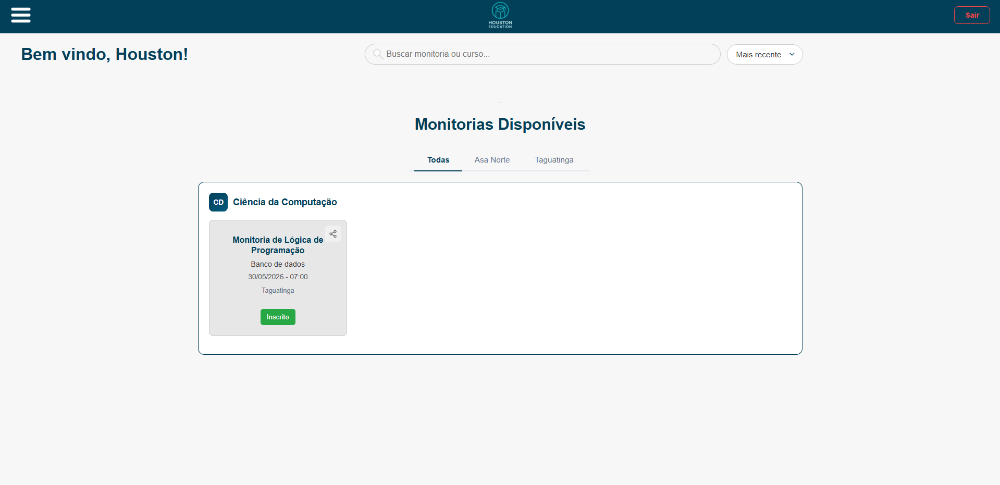

#### Minhas Inscrições
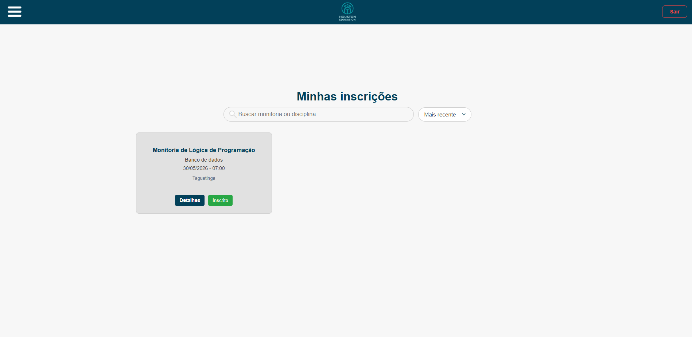

#### Gerenciar Monitorias
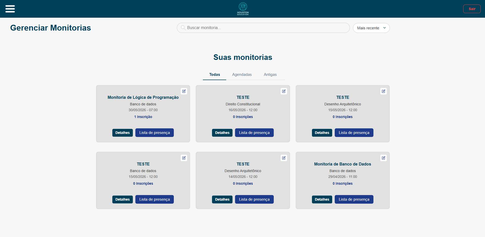

#### Histórico de Monitorias
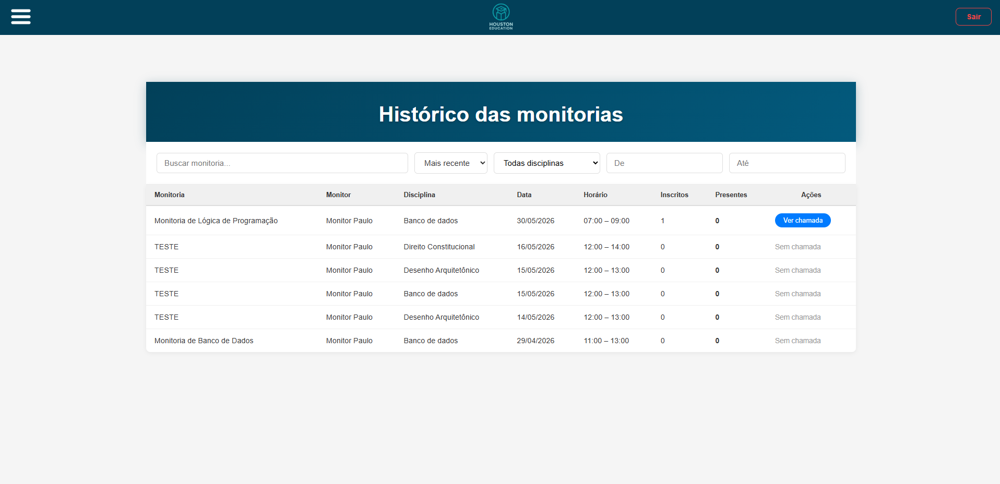

</details>

---

## [1.2.0] - 2026-05-08

### Added

**Aba Perfil**
- Criada página de Perfil (`perfil.html`) para atualização de dados pessoais (nome, email, matrícula).
- Adicionado item "Perfil" no menu lateral visível para todos os perfis (Aluno, Monitor e Admin).

**Botão de Detalhes na Aba de Gerenciamento**
- Adicionado botão "Detalhes" nos cards de monitoria na tela de gerenciamento.
- Exibe popup com lista de todos os alunos inscritos naquela monitoria.
- Criado endpoint separado para trazer as informações de inscritos.

**Validações e Regras de Negócio**
- Adicionado tratamento de erro para matrícula duplicada: query que verifica se a matrícula já existe no banco antes de cadastrar/atualizar. Ademais, foi adicionado a validação para horário de fim menor ou igual ao horário de início.
- Adicionada validação de campos vazios no update de aluno: nome e email não podem ser enviados como string vazia, permitindo que apenas um campo seja atualizado por vez.

**Repository de Aluno**
- Criada função `findByEmailAndMatricula` que busca por email OU matrícula em uma única query.
- Substituídos todos os usos de `findByEmail` e `findByMatricula` isolados pela nova função unificada.

### Changed

**Modal de Atualização de Monitorias**
- Remodelação da modal de atualização com layout mais compacto.
- Campo "Descrição" movido para linha própria abaixo de "Nome" e acima de "Data", utilizando `textarea` para textos longos.
- Dropdowns de local e disciplina agora são filtrados com base no campus e curso selecionados previamente.


**JWT**
- Token JWT agora inclui o campo `matricula` no payload, eliminando a necessidade de endpoint extra para buscar dados do usuário logado.

### Fixed

**Responsividade do Dashboard Admin**
- Adicionado scroll horizontal nas tabelas do dashboard para dispositivos móveis (telas < 768px).
- Reduzido tamanho dos botões de ação (editar/excluir) em mobile para melhor usabilidade.

**Layout e Popups**
- Corrigido vazamento de texto da descrição nos cards e popups de monitoria com quebra de linha (`word-wrap: break-word`).
- Corrigido caminho de redirecionamento da aba Perfil para a Home.

<details>
<summary>🖼️ <b>Clique aqui para visualizar as telas desta versão</b></summary>

<br>

#### Home
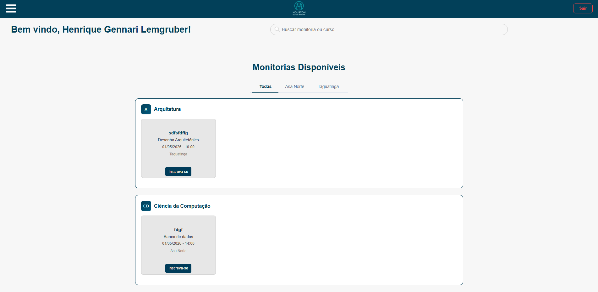

#### Dashboard Admin
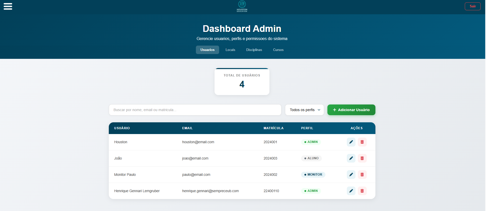
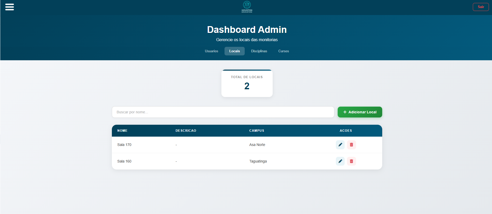
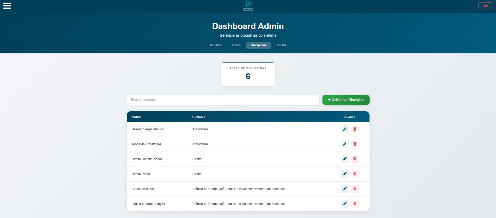
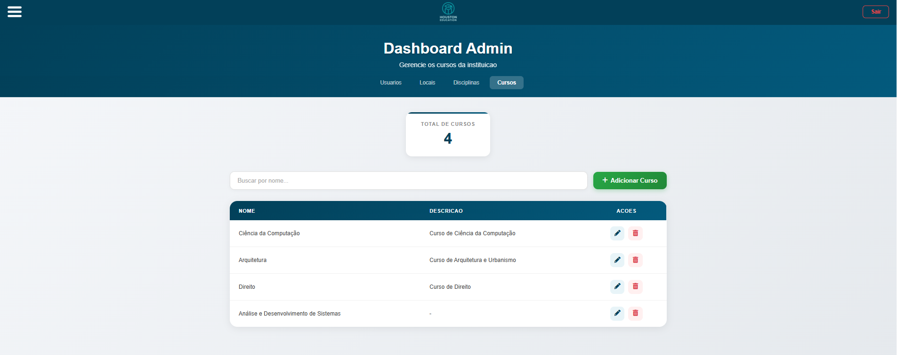

#### Monitorias
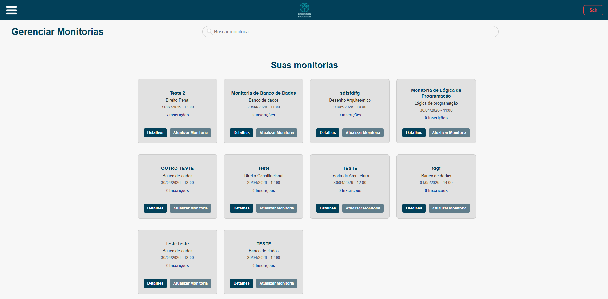
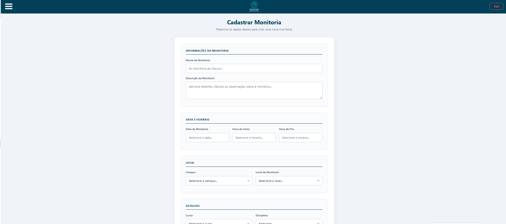

#### Perfil

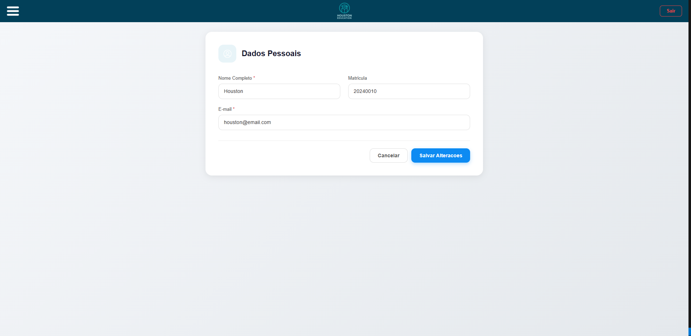

</details>


---


## [1.1.0] - 2026-04-30

### Added

**Entidade Curso**
- Criação da entidade `Curso` no schema do Prisma
- Tabela de junção `DisciplinaCurso` para relacionamento N:N entre Disciplina e Curso.
- CRUD completo da entidade Curso (Controller, Service, Repository).
- Páginas de dashboard para gerenciamento de disciplinas, locais e cursos no painel administrativo.
- Script `carregarCursos.js` para integração do frontend com a API de cursos.

**Associação Disciplina ↔ Curso**
- Associação de disciplinas com nenhum, um ou mais cursos nas operações de criação, atualização e consulta.
- Campos de curso incluídos nos dados retornados nas APIs de monitoria.

**Validação e Regras de Negócio**
- Adicionada unicidade (`@unique`) nos campos `nome` das entidades `Curso` e `Disciplina`.

**Infraestrutura**
- Nova migration `add_disciplina_curso` para criação das tabelas de Curso e DisciplinaCurso.
- Nova migration `add_unique_nome_curso_disciplina` para garantir unicidade nos nomes.
- Atualização do seed do banco de dados para refletir as novas entidades.

### Changed

**Layout da Home**
- Redesign do layout da página home com agrupamento de monitorias por curso em cards organizados.
- Cada card de monitoria agora exibe a sigla do curso associado.

**Dashboard Admin**
- Criação de páginas e scripts dedicados para gerenciamento de Locais, Disciplinas e Cursos no dashboard administrativo.
- Melhorias no CSS do painel administrativo (`estiloDashboardAdmin.css`).

### Fixed

**Fuso Horário das Monitorias**
- Corrigido o problema de deslocamento de 3 horas no cadastro e exibição das monitorias causado pela interpretação UTC em produção.
- Implementadas funções `criarDateBRT()` e `extrairHoraBRT()` no `MonitoriaService` para garantir que os horários sejam sempre tratados no padrão de Brasília (BRT, UTC-3).

**Layout da Tela de Gerenciamento**
- Ajustado o grid da página "Gerenciar Monitorias" para exibir 4 cards por linha em telas grandes.
- Removido o `max-width` dos cards para aproveitamento melhor do espaço disponível.

### Security
- Adicionada validação `noUnknown` nos schemas Yup para rejeitar campos não permitidos nas requisições.

<details>
<summary>🖼️ <b>Clique aqui para visualizar as telas desta versão</b></summary>

<br>

#### Home


#### Dashboard Admin


#### Monitorias
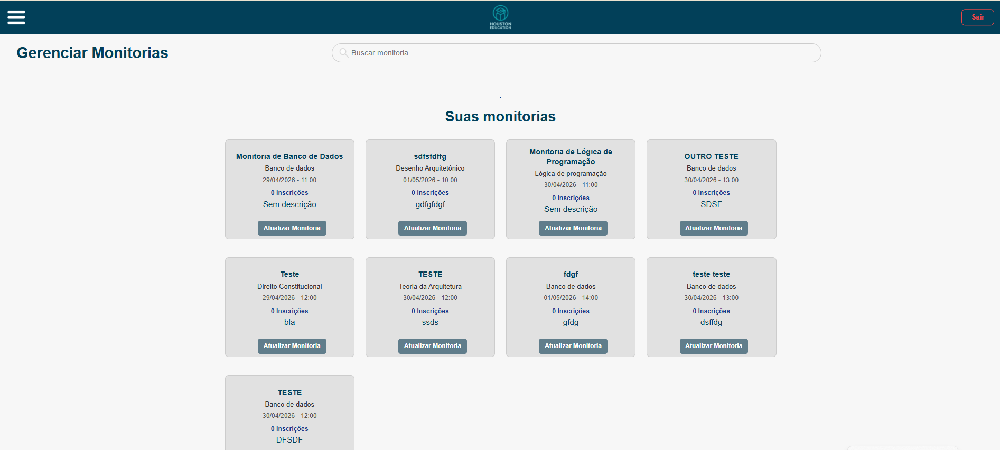


</details>

---


## [1.0.0] - 2026-04-28 - Primeira Versão oficial 


### Added
**Funcionalidades (Features)**
- CRUD completo e regras de negócio para as entidades: Aluno, Disciplina, Monitoria, Inscrições e Local.
- Páginas de interface de usuário (UI): Login, Home, Cadastro, Gerenciamento de Monitorias e Dashboard Admin.
- Sistema de autenticação de usuários integrado com JWT.

**Infraestrutura e Arquitetura**
- Estrutura inicial do projeto em Node.js com TypeScript.
- Configuração do servidor com Express.
- Integração com banco de dados PostgreSQL utilizando Prisma ORM.
- Criação de middlewares de segurança para autenticação, autorização e validação de requisições.
- Validação de schemas e rotas utilizando a biblioteca Yup.
- Separação da arquitetura em padrão MVC (Controller -> Service -> Repository).
- Implementação de Repositórios InMemory para a execução de testes isolados.
- Configuração de CI/CD via GitHub Actions para build automatizado.
- Estratégia de branches definida: `main` (produção) e `dev` (desenvolvimento contínuo).
- Deploy e hospedagem da aplicação configurados no Render.

<details>
<summary>🖼️ <b>Clique aqui para visualizar as telas desta versão</b></summary>

<br>

#### Login & Cadastro
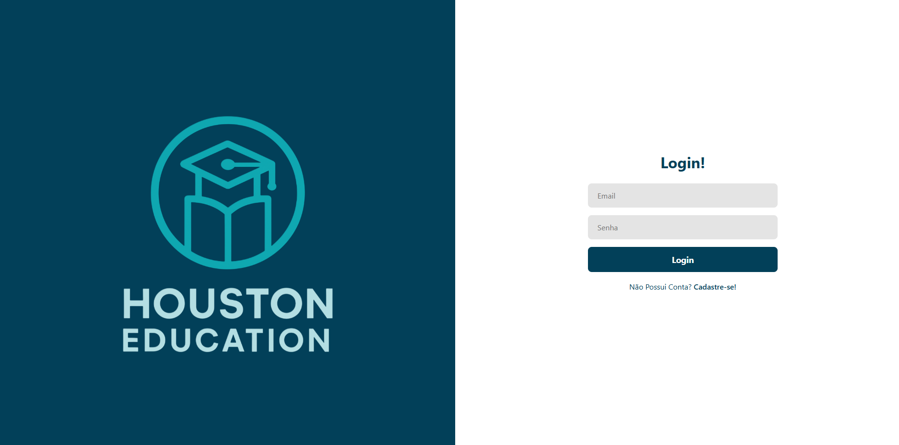
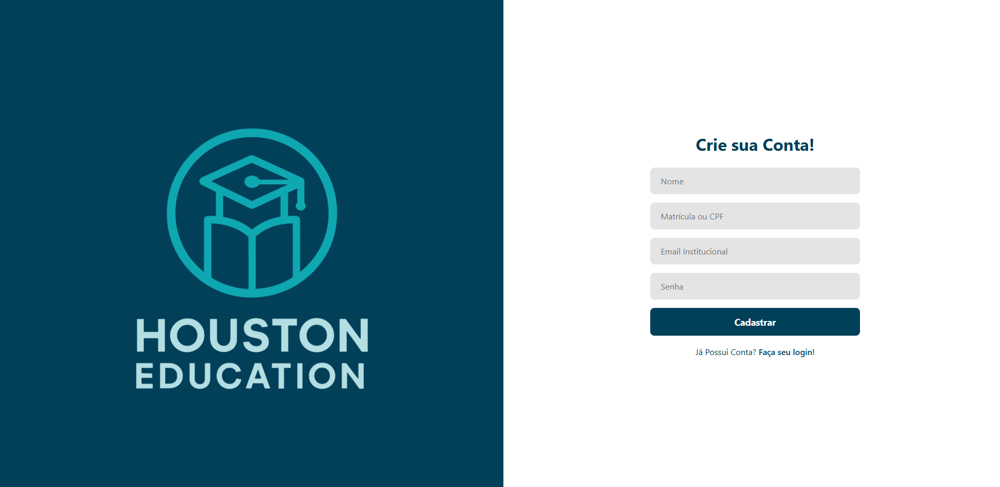

#### Home & Dashboard
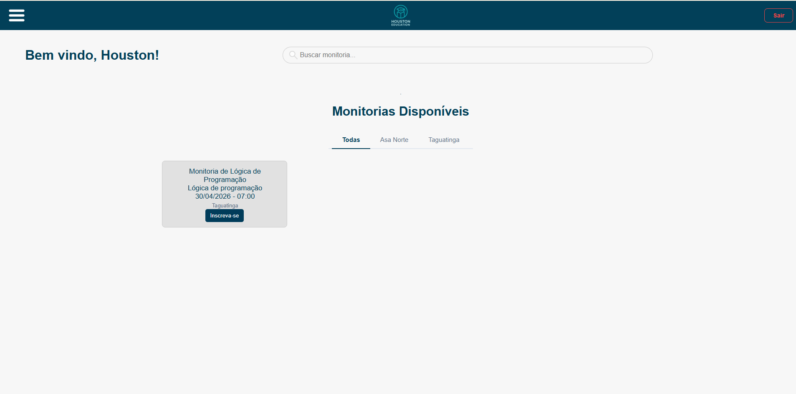
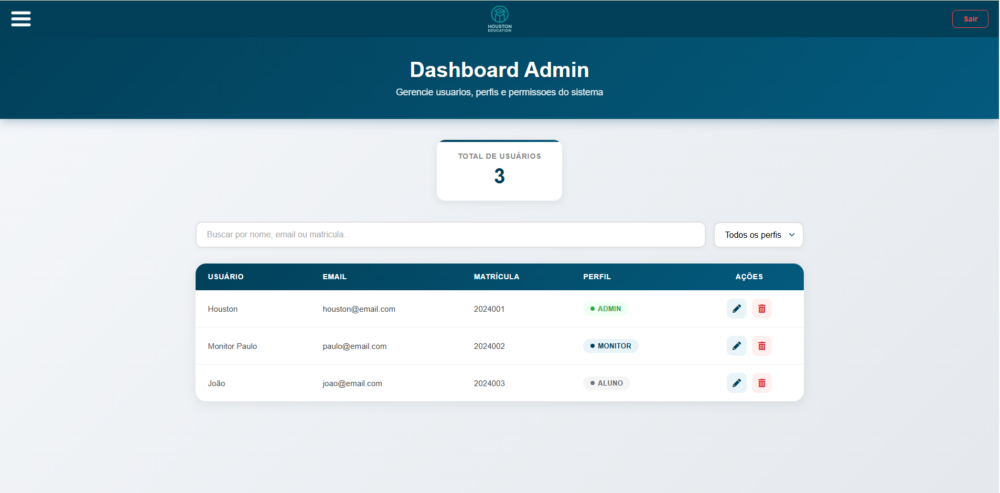

#### Monitorias
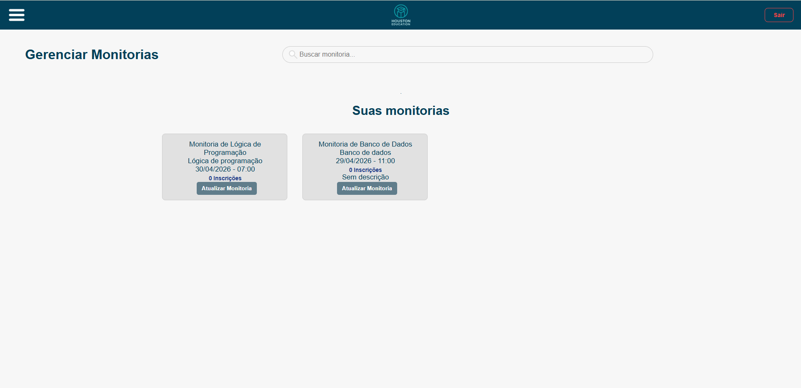
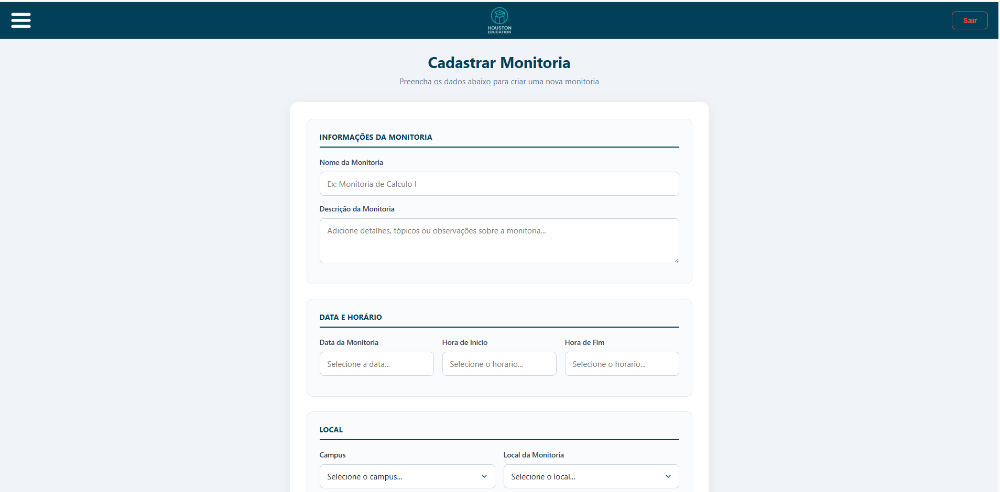

</details>


---

