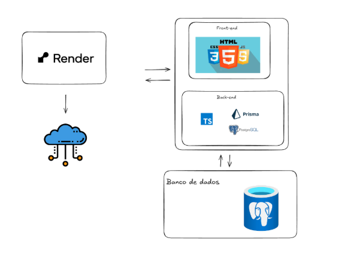
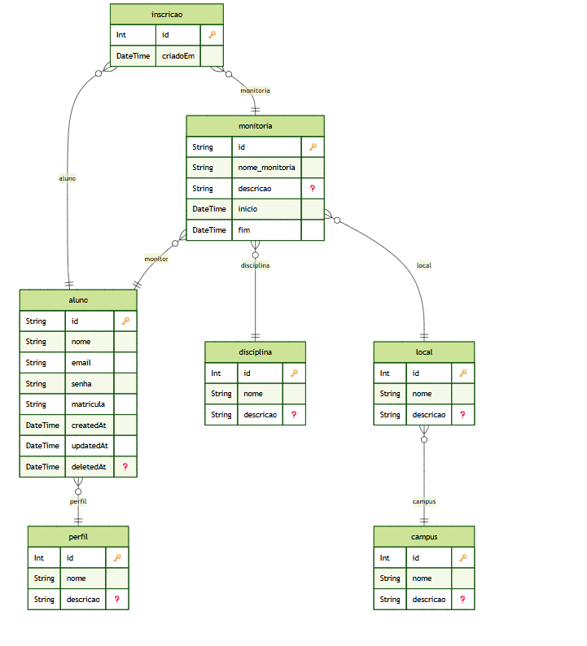

# Documento Houston Education

## Introducao

O documento tem a finalidade de capturar as restricoes de design e requisitos de alto nivel de um sistema de software. A ideia e mostrar para ao cliente uma visao macro do produto que sera desenvolvido e facilitar a sua compreensao, ou seja, seu objetivo e fornecer uma visao ampla do que se pretende desenvolver, sem se aprofundar em detalhes.

### 1.1 Objetivo

O objetivo deste documento e expor as necessidades e funcionalidades gerais da nossa aplicacao, definindo seu objetivo principal, razao de existencia, requisitos funcionais do sistema, tecnologias empregadas e etc.

### 1.2 Escopo

A Houston Education e uma aplicacao virtual capaz de exibir monitorias existentes dentro do contexto do UniCEUB, inscricao dos alunos nas mesmas e permite a adicao e atualizacao das monitorias para os monitores e administradores do sistema.

A principal ideia e ser simples e, com poucos cliques, o usuario principal (aluno) pode se inscrever na monitoria que deseja participar e finalizar sua atividade.

### 1.3 Justificativa

Sanar cenario problematico da ausencia de um espaco virtual publico e de facil acesso para visualizacao das monitorias da universidade.

### 1.4 Diferencial estrategico

Ambiente simplificado sem burocracia que permite visualizacao das monitorias, inscricao, adicao e atualizacao das mesmas, sendo o unico local disponivel da faculdade para efetuar as necessidades definidas no escopo desse documento.

## Especificacoes Tecnicas

### 2.1 Tecnologias

A seguir teremos a declaracao e especificacao das tecnologias empregadas na construcao da aplicacao assim como suas justificativas. Inicialmente, abordaremos o front-end e em seguida o back-end, alem da demonstracao visual da arquitetura do sistema.

#### 2.1.1 HTML, CSS, JavaScript

A aplicacao nao utilizou quaisquer frameworks disponiveis para criacao do front-end.

#### 2.1.2 Node

Utilizando o node para execucao de JavaScript no back-end da aplicacao, escolhido devido a linguagem que aplicacao utiliza que sera abordada no item 2.1.4 do topico.

#### 2.1.3 Express

Usando o framework Express para rodar a aplicacao de forma persistente e funcional, instanciando o servidor, rotas, alem de prover os arquivos de forma correta para o navegador.

#### 2.1.4 TypeScript

TypeScript foi a linguagem escolhida para a criacao da aplicacao de forma coesa e tipada, evitando erros e sendo extremamente preciso com o codigo.

#### 2.1.5 Prisma ORM

Para o auxilio na criacao de tabelas do banco de dados alem de comandos crucias para uma aplicacao, como CRUD 's, escolhemos uma ORM para facilitar o desenvolvimento do sistema. O prisma foi escolhido por ser usada com JavaScript.

#### 2.1.6 PostgreSQL

Escolhemos o PostgreSQL como banco de dados SQL devido afinidade tecnica, simples integracao com a ORM escolhida e producao do sistema.

#### 2.1.7 Render

Usando o Render para a hospedagem da aplicacao web, alem de utilizar um banco de dados remoto dedicado a aplicacao.

### 2.2 Arquitetura

### 2.3 Servicos/ Rotas

Rotas da aplicacao responsaveis, respectivamente, por suas finalidades cruciais e unicas

- "alunos": http://localhost:3000/alunos/
- "monitorias": http://localhost:3000/monitorias/
- "inscricao": http://localhost:3000/inscricoes/
- "disciplinas": http://localhost:3000/disciplinas/
- "locais": http://localhost:3000/locais/
- "campus": http://localhost:3000/campus/
- "login": http://localhost:3000/login/
- "home": http://localhost:3000/home/
- "logout": http://localhost:3000/logout/
- "dashboard-admin": http://localhost:3000/dashboard-admin
- "gerenciar-monitorias": http://localhost:3000/gerenciar-monitorias

### 2.4 Modelo de dados

O diagrama entidade-relacionamento (ERD) completo do sistema esta disponivel no arquivo `prisma/erd.svg`, gerado automaticamente a partir do schema do Prisma. Ele ilustra todas as tabelas, seus atributos e os relacionamentos entre as entidades (Aluno, Monitoria, Inscricao, Disciplina, Local, Campus e Perfil).

## 3. Dimensao Negocial

### 3.1. Problema e Oportunidade

O setor de ensino superior em Tecnologia da Informacao e Comunicacao (TIC) vive um paradoxo: enquanto o numero de matriculas cresceu 10,5% recentemente, a taxa de desistencia acumulada na rede privada chegou a alarmantes 64,7%, segundo o Mapa do Ensino Superior 2026 (Semesp/INEP). A principal causa desse cenario e a dificuldade dos alunos em disciplinas criticas de base logo nos primeiros semestres.

Muitos desses estudantes enfrentam severas barreiras no aprendizado por nao encontrarem suporte imediato. Atualmente, os processos de monitoria e busca por ajuda sao descentralizados e informais (baseados em grupos de aplicativos de mensagem ou avisos fisicos em murais). Isso gera uma barreira de acesso, perda de tempo e desmotivacao, fatores que culminam no abandono do curso.

Existe, portanto, uma oportunidade clara de digitalizar e otimizar esse processo. A criacao de um canal oficial e centralizado tem o potencial de conectar rapidamente quem precisa aprender com quem esta apto a ensinar, combatendo a evasao e melhorando a experiencia academica.

### 3.2. Publico-Alvo

O ecossistema da plataforma atende a tres perfis interligados:

- **Estudantes de Graduacao:** Alunos que enfrentam dificuldades em disciplinas especificas e buscam auxilio extra para superar barreiras de aprendizado e melhorar o desempenho academico.
- **Monitores:** Alunos com bom desempenho que desejam organizar suas atividades de ensino, aprimorar seus proprios conhecimentos e desenvolver habilidades de mentoria.
- **Instituicoes de Ensino:** Universidades e faculdades que buscam modernizar seus processos de suporte ao aluno e melhorar a gestao de seus programas extracurriculares.

### 3.3. Beneficios da Solucao

A implementacao do Houston Education gera impactos positivos diretos, embasados pela ciencia da aprendizagem:

- **Melhora no Desempenho:** Estudos de meta-analise em educacao (Hattie, 2023) indicam que a tutoria por pares (monitoria) pode acelerar o aprendizado em ate 0,45 de desvio padrao, o equivalente a um salto de 20% a 30% na media final do aluno tutorado.
- **Efeito Protege:** Para o monitor, o beneficio e exponencial. Pesquisas indicam que quem ensina retem ate 90% do conteudo, contra apenas 10% de quem apenas le a materia.
- **Retencao Institucional:** Instituicoes que digitalizam e incentivam programas de monitoria conseguem reduzir a evasao em disciplinas criticas em ate 15%, garantindo a sustentabilidade financeira do curso e o sucesso dos alunos.

### 3.4. Proposta de Valor

O Houston Education democratiza e centraliza o suporte academico, transformando a monitoria universitaria em uma experiencia agil, acessivel e baseada em dados.

- **Para o aluno com dificuldade:** Entregamos suporte direcionado.
- **Para o monitor:** Oferecemos um ambiente estruturado para o desenvolvimento de habilidades de ensino e gestao de tempo.
- **Para a instituicao:** Fornecemos uma ferramenta estrategica para a modernizacao do apoio estudantil.

### 3.5. Contexto de Uso do Sistema

O sistema sera integrado ao cotidiano academico como a ponte digital oficial para o reforco escolar.

- **Cenario do Aluno:** Ao encontrar dificuldade em uma disciplina de base (ex: Algoritmos), o estudante acessa a plataforma via smartphone ou computador, pesquisa pela materia e visualiza imediatamente os monitores e monitorias disponiveis, podendo participar de uma sessao de estudos.
- **Cenario do Monitor:** O aluno-tutor acessa a aplicacao, pode criar monitorias que deseja ministrar e acessa informacoes gerais sobre as mesmas.

## 4. Conclusao

A plataforma foi criada com o intuito de promover um espaco virtual de simples uso e acesso pelos estudantes do UniCEUB. A aplicacao foi montada pensando na sua escalabilidade de funcionamento e facil disponibilidade.
